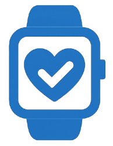

# 📱 VitalRecorder App

<div align="center">
  
  
  ### Sistema Integral de Recordatorios de Medicamentos y Actividades
  
  [](https://flutter.dev)
  [](https://dart.dev)
  [](https://firebase.google.com)
  [](https://www.android.com)
  [](https://github.com/jdanigh03/VitalRecorder-App)
  [](LICENSE)
</div>

---

## 📋 Tabla de Contenidos

- [Descripción](#-descripción)
- [Características Principales](#-características-principales)
- [Tecnologías Utilizadas](#-tecnologías-utilizadas)
- [Arquitectura del Proyecto](#-arquitectura-del-proyecto)
- [Requisitos Previos](#-requisitos-previos)
- [Instalación](#-instalación)
- [Configuración](#-configuración)
- [Uso](#-uso)
- [Integración con Manilla VitalRecorder](#-integración-con-manilla-vitalrecorder)
- [Exportación de Datos](#-exportación-de-datos)
- [Notificaciones](#-notificaciones)
- [Contribuir](#-contribuir)
- [Licencia](#-licencia)

---

## 📖 Descripción

**VitalRecorder** es una aplicación móvil desarrollada en Flutter para Android, diseñada específicamente para ayudar a adultos mayores y personas con dificultades para recordar sus medicamentos y actividades diarias. La aplicación ofrece un sistema completo de recordatorios con seguimiento de adherencia y supervisión remota a través de cuidadores.

### 🎯 Público Objetivo

- Adultos mayores
- Personas con tratamientos médicos complejos
- Pacientes con dificultades de memoria
- Cuidadores y familiares responsables del cuidado de personas dependientes

---

## ✨ Características Principales

### 🔔 Sistema de Recordatorios
- **Recordatorios de medicamentos**: Programa tomas de medicinas con horarios personalizados
- **Recordatorios de actividades**: Agenda citas médicas, ejercicios, y actividades diarias
- **Notificaciones push**: Alertas puntuales con Firebase Cloud Messaging
- **Notificaciones locales**: Recordatorios que funcionan sin conexión a internet
- **Calendario integrado**: Visualiza todos tus recordatorios en un calendario mensual

### 👨‍⚕️ Sistema de Cuidadores
- **Supervisión remota**: Los cuidadores pueden monitorear si el usuario está cumpliendo con sus recordatorios
- **Gestión de adherencia**: Visualización del porcentaje de cumplimiento
- **Alertas para cuidadores**: Notificaciones cuando el usuario no toma sus medicamentos

### ⌚ Integración con Dispositivo IoT
- **Manilla VitalRecorder**: Conectividad Bluetooth con nuestra manilla inteligente
- **Sincronización automática**: Los datos se sincronizan entre la app y el dispositivo
- **Monitoreo continuo**: La manilla puede enviar recordatorios táctiles

### 📊 Reportes y Análisis
- **Gráficos de adherencia**: Visualiza tu cumplimiento con gráficos interactivos
- **Historial completo**: Registro detallado de todas las tomas y actividades
- **Exportación a PDF**: Genera reportes profesionales para compartir con médicos
- **Exportación a CSV**: Descarga tus datos para análisis externo

### 🔐 Autenticación Segura
- **Firebase Authentication**: Inicio de sesión seguro
- **Login con Google**: Acceso rápido con tu cuenta de Google
- **Login con Facebook**: Integración con redes sociales
- **Gestión de sesiones**: Mantén tu información protegida

### 🌐 Funcionalidades Adicionales
- **Navegación web integrada**: Accede a recursos médicos sin salir de la app
- **Compartir reportes**: Comparte fácilmente tus informes con familiares y médicos
- **Servicio en segundo plano**: La app funciona incluso cuando está cerrada
- **Modo offline**: Funcionalidades básicas disponibles sin internet

---

## 🛠 Tecnologías Utilizadas

### Framework y Lenguaje
- **Flutter 3.7.2+**: Framework de desarrollo multiplataforma
- **Dart 3.7.2+**: Lenguaje de programación

### Backend y Base de Datos
- **Firebase Core**: Plataforma de desarrollo de aplicaciones
- **Cloud Firestore**: Base de datos NoSQL en tiempo real
- **Firebase Authentication**: Sistema de autenticación
- **Firebase Messaging**: Notificaciones push

### Conectividad
- **Flutter Blue Plus**: Comunicación Bluetooth con la manilla
- **HTTP & Dio**: Peticiones HTTP y gestión de APIs
- **URL Launcher**: Apertura de enlaces externos

### UI/UX
- **Table Calendar**: Calendario interactivo
- **FL Chart**: Gráficos y visualización de datos
- **Flutter InAppWebView**: Navegador web integrado

### Almacenamiento y Datos
- **Shared Preferences**: Almacenamiento local de preferencias
- **Path Provider**: Acceso al sistema de archivos
- **CSV**: Generación de archivos CSV
- **PDF**: Generación de documentos PDF

### Utilidades
- **Share Plus**: Compartir archivos y contenido
- **Gal**: Gestión de galería
- **Permission Handler**: Manejo de permisos de Android
- **Flutter Local Notifications**: Notificaciones locales
- **Timezone**: Gestión de zonas horarias
- **WorkManager**: Tareas en segundo plano
- **Intl**: Internacionalización y formato de fechas

---

## 🏗 Arquitectura del Proyecto

```
lib/
├── main.dart                      # Punto de entrada de la aplicación
├── models/                        # Modelos de datos
│   ├── user_model.dart           # Modelo de usuario
│   ├── reminder_model.dart       # Modelo de recordatorio
│   ├── medication_model.dart     # Modelo de medicamento
│   └── activity_model.dart       # Modelo de actividad
├── screens/                       # Pantallas de la aplicación
│   ├── auth/                     # Pantallas de autenticación
│   │   ├── login_screen.dart
│   │   ├── register_screen.dart
│   │   └── forgot_password_screen.dart
│   ├── home/                     # Pantalla principal
│   │   └── home_screen.dart
│   ├── calendar/                 # Pantalla de calendario
│   │   └── calendar_screen.dart
│   ├── reminders/                # Gestión de recordatorios
│   │   ├── reminders_list_screen.dart
│   │   ├── add_reminder_screen.dart
│   │   └── reminder_detail_screen.dart
│   ├── profile/                  # Perfil de usuario
│   │   └── profile_screen.dart
│   ├── caregiver/                # Panel de cuidador
│   │   └── caregiver_dashboard_screen.dart
│   ├── bluetooth/                # Conexión con manilla
│   │   └── bluetooth_screen.dart
│   └── reports/                  # Reportes y estadísticas
│       ├── reports_screen.dart
│       └── adherence_chart_screen.dart
├── services/                      # Servicios y lógica de negocio
│   ├── auth_service.dart         # Servicio de autenticación
│   ├── firestore_service.dart    # Servicio de Firestore
│   ├── notification_service.dart # Servicio de notificaciones
│   ├── bluetooth_service.dart    # Servicio de Bluetooth
│   ├── background_service.dart   # Servicio en segundo plano
│   └── export_service.dart       # Servicio de exportación
├── widgets/                       # Widgets reutilizables
│   ├── custom_button.dart
│   ├── reminder_card.dart
│   ├── calendar_widget.dart
│   └── chart_widget.dart
├── utils/                         # Utilidades y helpers
│   ├── constants.dart            # Constantes de la aplicación
│   ├── date_utils.dart           # Utilidades de fechas
│   ├── validators.dart           # Validadores de formularios
│   └── pdf_generator.dart        # Generador de PDFs
└── config/                        # Configuración
    ├── firebase_config.dart      # Configuración de Firebase
    ├── routes.dart               # Rutas de la aplicación
    └── theme.dart                # Tema y estilos

assets/
├── vital_recorder_logo.png       # Logo de la aplicación
├── vital_recorder_nobg.png       # Logo sin fondo
├── 2023_Facebook_icon.svg.png    # Icono de Facebook
└── Google__G__logo.svg.png       # Icono de Google

android/                           # Configuración de Android
ios/                              # Configuración de iOS (futuro)
web/                              # Configuración web (futuro)
```

### 📐 Patrones de Arquitectura

La aplicación sigue los siguientes patrones y principios:

- **Separación de responsabilidades**: Modelos, vistas y servicios separados
- **Service Layer Pattern**: Lógica de negocio encapsulada en servicios
- **Repository Pattern**: Abstracción de fuentes de datos
- **Singleton Pattern**: Para servicios compartidos (Firebase, Bluetooth)
- **Observer Pattern**: Para notificaciones y actualizaciones en tiempo real

### 🔄 Flujo de Datos

```
Usuario → UI (Screens/Widgets)
           ↓
       Services (Business Logic)
           ↓
   Firebase/Local Storage
           ↓
       Models (Data)
           ↓
       UI Update (setState/Streams)
```

---

## 📋 Requisitos Previos

Antes de instalar y ejecutar la aplicación, asegúrate de tener:

### Software Necesario
- **Flutter SDK 3.7.2 o superior** - [Instalar Flutter](https://docs.flutter.dev/get-started/install)
- **Dart 3.7.2 o superior** - (incluido con Flutter)
- **Android Studio** o **VS Code** con extensiones de Flutter
- **Git** - Para clonar el repositorio

### Cuenta y Servicios
- **Cuenta de Firebase** - Para backend y autenticación
- **Proyecto de Firebase configurado** con:
  - Authentication (Google y Facebook habilitados)
  - Cloud Firestore
  - Firebase Cloud Messaging
  - Firebase Storage (opcional)

### Hardware
- **Dispositivo Android** con:
  - Android 5.0 (API 21) o superior
  - Bluetooth 4.0 o superior (para conectar con la manilla)
  - Mínimo 2GB de RAM
- **Manilla VitalRecorder** (opcional, para funcionalidad completa)

---

## 🚀 Instalación

### 1. Clonar el Repositorio

```bash
git clone https://github.com/jdanigh03/VitalRecorder-App.git
cd VitalRecorder-App
```

### 2. Instalar Dependencias

```bash
flutter pub get
```

### 3. Configurar Firebase

1. Ve a [Firebase Console](https://console.firebase.google.com/)
2. Crea un nuevo proyecto o usa uno existente
3. Agrega una aplicación Android a tu proyecto Firebase
4. Descarga el archivo `google-services.json`
5. Coloca el archivo en `android/app/`

### 4. Configurar Authentication Providers

#### Google Sign-In:
1. En Firebase Console, ve a Authentication > Sign-in method
2. Habilita Google
3. Configura el OAuth consent screen
4. Obtén el SHA-1 de tu certificado:
   ```bash
   keytool -list -v -keystore ~/.android/debug.keystore -alias androiddebugkey -storepass android -keypass android
   ```
5. Agrega el SHA-1 en la configuración de tu app en Firebase

#### Facebook Sign-In:
1. Crea una app en [Facebook Developers](https://developers.facebook.com/)
2. Obtén el App ID y App Secret
3. En Firebase Console, habilita Facebook y configura con tus credenciales
4. Agrega el siguiente código en `android/app/src/main/res/values/strings.xml`:
   ```xml
   <string name="facebook_app_id">TU_FACEBOOK_APP_ID</string>
   <string name="fb_login_protocol_scheme">fbTU_FACEBOOK_APP_ID</string>
   ```

### 5. Configurar Permisos de Android

Verifica que `android/app/src/main/AndroidManifest.xml` incluya:

```xml
<uses-permission android:name="android.permission.INTERNET"/>
<uses-permission android:name="android.permission.BLUETOOTH"/>
<uses-permission android:name="android.permission.BLUETOOTH_ADMIN"/>
<uses-permission android:name="android.permission.BLUETOOTH_SCAN" android:usesPermissionFlags="neverForLocation" />
<uses-permission android:name="android.permission.BLUETOOTH_CONNECT" />
<uses-permission android:name="android.permission.ACCESS_FINE_LOCATION"/>
<uses-permission android:name="android.permission.POST_NOTIFICATIONS"/>
<uses-permission android:name="android.permission.SCHEDULE_EXACT_ALARM"/>
<uses-permission android:name="android.permission.USE_EXACT_ALARM"/>
<uses-permission android:name="android.permission.WAKE_LOCK"/>
<uses-permission android:name="android.permission.RECEIVE_BOOT_COMPLETED"/>
<uses-permission android:name="android.permission.WRITE_EXTERNAL_STORAGE"/>
<uses-permission android:name="android.permission.READ_EXTERNAL_STORAGE"/>
```

### 6. Generar Iconos de la App

```bash
flutter pub run flutter_launcher_icons
```

### 7. Ejecutar la Aplicación

#### En modo debug:
```bash
flutter run
```

#### Generar APK de producción:
```bash
flutter build apk --release
```

#### Generar App Bundle:
```bash
flutter build appbundle --release
```

El APK estará en: `build/app/outputs/flutter-apk/app-release.apk`

---

## ⚙️ Configuración

### Variables de Entorno

Crea un archivo `lib/config/env.dart` (no incluido en el repositorio):

```dart
class Environment {
  static const String apiUrl = 'TU_API_URL';
  static const String firebaseApiKey = 'TU_FIREBASE_API_KEY';
  // Otras configuraciones sensibles
}
```

### Configuración de Notificaciones

Las notificaciones se configuran automáticamente al iniciar la app. Para personalizar:

1. Abre `lib/services/notification_service.dart`
2. Modifica los canales de notificación según tus necesidades
3. Configura los sonidos y prioridades

### Configuración de Zona Horaria

La aplicación usa la zona horaria del dispositivo por defecto. Para cambiarla:

```dart
// En lib/main.dart
import 'package:timezone/data/latest.dart' as tz;
import 'package:timezone/timezone.dart' as tz;

void main() {
  tz.initializeTimeZones();
  tz.setLocalLocation(tz.getLocation('America/La_Paz')); // Ejemplo: Bolivia
  runApp(MyApp());
}
```

---

## 💡 Uso

### Primer Inicio

1. **Registro**: Crea una cuenta con email o usa Google/Facebook
2. **Permisos**: Acepta los permisos de notificaciones y Bluetooth
3. **Perfil**: Completa tu información básica

### Agregar un Recordatorio

1. Toca el botón "+" en la pantalla principal
2. Selecciona el tipo: Medicamento o Actividad
3. Completa la información:
   - Nombre
   - Descripción
   - Horarios (puedes agregar múltiples)
   - Días de la semana
   - Duración del tratamiento
4. Guarda el recordatorio

### Gestionar Recordatorios

- **Ver**: Toca un recordatorio para ver sus detalles
- **Editar**: Usa el ícono de edición
- **Eliminar**: Desliza hacia la izquierda
- **Marcar como tomado**: Toca el checkbox cuando recibas la notificación

### Sistema de Cuidadores

#### Como Usuario:
1. Ve a tu perfil
2. Selecciona "Agregar Cuidador"
3. Ingresa el email del cuidador
4. Envía la invitación

#### Como Cuidador:
1. Acepta la invitación recibida por email
2. Accede al panel de cuidador desde el menú
3. Visualiza el cumplimiento de tus pacientes
4. Recibe alertas cuando no tomen sus medicamentos

### Visualizar Estadísticas

1. Ve a la sección "Reportes"
2. Selecciona el período (semana, mes, año)
3. Visualiza gráficos de:
   - Adherencia general
   - Cumplimiento por medicamento
   - Tendencias temporales

---

## ⌚ Integración con Manilla VitalRecorder

### Emparejar la Manilla

1. Ve a "Configuración" > "Dispositivos"
2. Toca "Conectar Manilla VitalRecorder"
3. Activa Bluetooth en tu teléfono
4. Selecciona tu manilla de la lista
5. Espera la confirmación de conexión

### Funcionalidades con la Manilla

- **Recordatorios vibración**: La manilla vibrará al llegar la hora del medicamento
- **Confirmación de toma**: Presiona el botón de la manilla para confirmar
- **Sincronización**: Los datos se sincronizan automáticamente
- **Batería**: Verifica el nivel de batería desde la app

### Solución de Problemas Bluetooth

- **No se detecta la manilla**:
  - Verifica que esté encendida y cerca del teléfono
  - Reinicia el Bluetooth
  - Asegúrate de que los permisos estén otorgados

- **Desconexión frecuente**:
  - Mantén la manilla y el teléfono cerca
  - Verifica la batería de ambos dispositivos
  - Desempareja y vuelve a emparejar

---

## 📤 Exportación de Datos

### Exportar a PDF

1. Ve a "Reportes" > "Exportar"
2. Selecciona "PDF"
3. Elige el período a exportar
4. Selecciona qué incluir:
   - Historial de tomas
   - Gráfico de adherencia
   - Lista de medicamentos
   - Información del cuidador
5. Toca "Generar PDF"
6. Comparte o guarda el archivo

El PDF incluye:
- Información del paciente
- Porcentaje de adherencia
- Gráficos visuales
- Historial detallado con fechas y horas
- Observaciones del cuidador

### Exportar a CSV

1. Ve a "Reportes" > "Exportar"
2. Selecciona "CSV"
3. Elige el rango de fechas
4. El archivo CSV contendrá:
   - Fecha y hora de cada recordatorio
   - Nombre del medicamento/actividad
   - Estado (tomado/no tomado)
   - Observaciones

Útil para:
- Análisis en Excel
- Procesamiento de datos
- Importación a otros sistemas

---

## 🔔 Notificaciones

### Tipos de Notificaciones

1. **Recordatorios de medicamentos**: Notificación exacta a la hora programada
2. **Recordatorios de actividades**: Alerta 15 minutos antes
3. **Alertas de cuidador**: Cuando el usuario no toma un medicamento
4. **Recordatorios de reabastecimiento**: Cuando quedan pocas dosis

### Personalización

- Sonido personalizado
- Prioridad (alta, media, baja)
- Repetición si no se atiende
- Modo No Molestar respetado

### Notificaciones en Segundo Plano

La app usa **WorkManager** para garantizar que las notificaciones lleguen incluso si:
- La app está cerrada
- El dispositivo está en modo ahorro de energía
- Después de reiniciar el teléfono

---

## 🤝 Contribuir

¡Las contribuciones son bienvenidas! Si deseas mejorar VitalRecorder:

### Cómo Contribuir

1. Fork el proyecto
2. Crea una rama para tu feature (`git checkout -b feature/AmazingFeature`)
3. Commit tus cambios (`git commit -m 'Add some AmazingFeature'`)
4. Push a la rama (`git push origin feature/AmazingFeature`)
5. Abre un Pull Request

### Guía de Estilo

- Usa nombres descriptivos para variables y funciones
- Comenta código complejo
- Sigue las convenciones de Dart/Flutter
- Ejecuta `flutter analyze` antes de hacer commit
- Asegúrate de que todas las pruebas pasen

### Reportar Bugs

Abre un issue e incluye:
- Descripción del problema
- Pasos para reproducirlo
- Comportamiento esperado vs actual
- Screenshots si aplica
- Versión de la app y Android

---

## 📄 Licencia

Este proyecto está bajo la Licencia MIT. Ver el archivo [LICENSE](LICENSE) para más detalles.

```
MIT License

Copyright (c) 2024 VitalRecorder Team

Permission is hereby granted, free of charge, to any person obtaining a copy
of this software and associated documentation files (the "Software"), to deal
in the Software without restriction, including without limitation the rights
to use, copy, modify, merge, publish, distribute, sublicense, and/or sell
copies of the Software, and to permit persons to whom the Software is
furnished to do so, subject to the following conditions:

The above copyright notice and this permission notice shall be included in all
copies or substantial portions of the Software.

THE SOFTWARE IS PROVIDED "AS IS", WITHOUT WARRANTY OF ANY KIND, EXPRESS OR
IMPLIED, INCLUDING BUT NOT LIMITED TO THE WARRANTIES OF MERCHANTABILITY,
FITNESS FOR A PARTICULAR PURPOSE AND NONINFRINGEMENT. IN NO EVENT SHALL THE
AUTHORS OR COPYRIGHT HOLDERS BE LIABLE FOR ANY CLAIM, DAMAGES OR OTHER
LIABILITY, WHETHER IN AN ACTION OF CONTRACT, TORT OR OTHERWISE, ARISING FROM,
OUT OF OR IN CONNECTION WITH THE SOFTWARE OR THE USE OR OTHER DEALINGS IN THE
SOFTWARE.
```


<div align="center">

**Hecho con ❤️ para mejorar la calidad de vida de nuestros adultos mayores**

</div>

---

## 📊 Estado del Proyecto

- ✅ Versión 1.0.2 - Estable
- 📱 Disponible para Android

